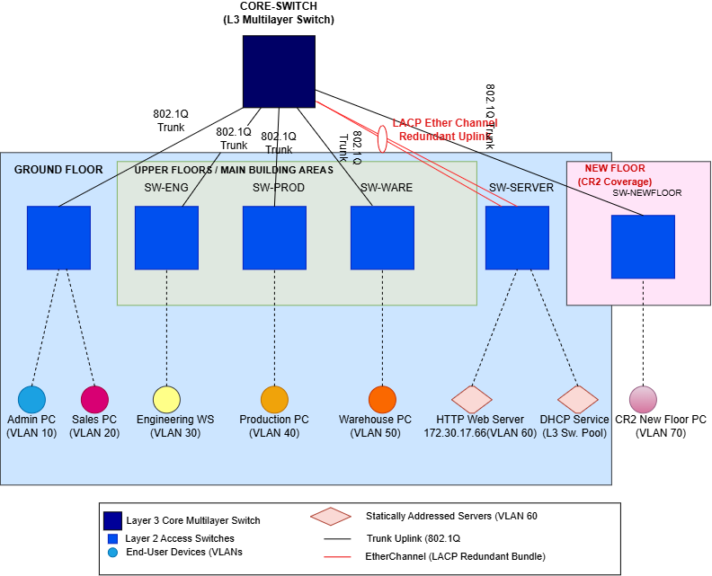
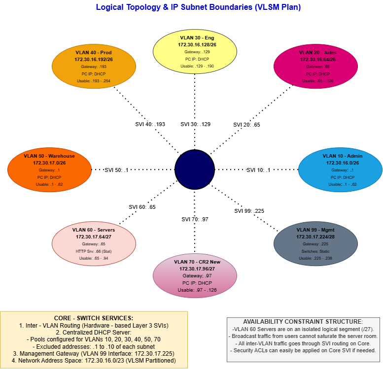

# Tau Metalworks & Engineering Supplies — Network Design and Implementation

CMPG 325 (Computer Networks) Individual Semester Project — North-West University, 2026.

This repository contains the design proposal, Packet Tracer implementation, and supporting evidence for the network designed for Tau Metalworks & Engineering Supplies, a manufacturing client based in Potchefstroom. The repository is structured to reflect the project's progression from requirements analysis through to final submission, with the commit history intended to demonstrate the iterative development of the design across the semester.

## Project Information

| Field | Detail |
|---|---|
| Student | T. Magwatane (42710677) |
| Project ID | CMPG325-2026-034 |
| Client ID | CLI-034 |
| Assigned Organisation | Tau Metalworks & Engineering Supplies (Potchefstroom) |
| Industry | Manufacturing |
| Assigned Addressing Block | 172.30.16.0/23 |
| Assigned Networking Challenge | HTTP/Web Server (internal web service hosting) — Intermediate |
| Design Constraint | Critical services (file/print/application) must remain available during business hours |
| Client Change Request | CR2 — the client has taken over an additional floor/area of the building |
| Project Period | 14 August 2026 – 16 October 2026 |

## Repository Structure

```
tau-metalworks-network-cmpg325-2026034/
├── README.md
├── 01-requirements/
│   └── client-requirements.md
├── 02-design/
│   ├── physical-topology.png
│   ├── logical-topology.png
│   └── design-decisions.md
├── 03-ip-addressing/
│   └── ip-addressing-plan.md
├── 04-configuration/
│   └── device-configs/        # exported running-configuration files per device
├── 05-testing/
│   ├── testing-log.md
│   └── screenshots/
├── 06-troubleshooting/
│   └── issues-and-fixes.md
├── 07-change-request-CR2/
│   └── cr2-implementation.md
├── packet-tracer/
│   └── tau-metalworks-network.pkt
└── technical-report.pdf
```

## Design Summary

A two-tier, extended-star topology was adopted for this network. A single Layer-3 core multilayer switch performs inter-VLAN routing and hosts the DHCP service, while each floor or functional area is served by its own access switch, trunked back to the core over 802.1Q. Two alternative topologies were considered and subsequently rejected: a flat, single-switch design, which would constitute a single point of failure and directly conflict with the availability constraint; and a full-mesh design, which would introduce cabling and configuration overhead disproportionate to the size of the organisation, while also complicating the incorporation of the change request. The complete rationale for this decision is documented in [`02-design/design-decisions.md`](02-design/design-decisions.md).

**Physical Topology** — device placement and cabling by floor, including the redundant LACP EtherChannel uplink to the server switch:



The Ground Floor, the upper-floor departments (Engineering, Production, Warehouse), the server switch, and the new CR2 floor are each served by a dedicated access switch, trunked to the core over 802.1Q. The server switch (SW-SERVER) is connected to the core via a bundled LACP EtherChannel uplink rather than a single link, constituting the physical-layer component of the response to the availability constraint, whereby a single failed cable or port does not result in the loss of HTTP or DHCP services.

**Logical Topology** — VLANs, subnet boundaries, and SVI gateways on the core switch:



Each VLAN is represented as a discrete subnet with its own SVI gateway on the core switch, with subnet sizes allocated according to VLSM principles rather than a uniform fixed size. VLAN 60 (Servers) is provisioned on an isolated /27 subnet, accessible only via routed inter-VLAN traffic through the core; this segment has also been identified as the appropriate point for the future application of a security access control list, should more restrictive access to the server segment be required.

## IP Addressing Plan (172.30.16.0/23)

| VLAN | Department | Subnet | Gateway |
|---|---|---|---|
| 10 | Administration | 172.30.16.0/26 | 172.30.16.1 |
| 20 | Sales | 172.30.16.64/26 | 172.30.16.65 |
| 30 | Engineering | 172.30.16.128/26 | 172.30.16.129 |
| 40 | Production Floor | 172.30.16.192/26 | 172.30.16.193 |
| 50 | Warehouse | 172.30.17.0/26 | 172.30.17.1 |
| 60 | Servers (HTTP static .66 / DHCP) | 172.30.17.64/27 | 172.30.17.65 |
| 70 | New Floor (CR2) | 172.30.17.96/27 | 172.30.17.97 |
| 99 | Management | 172.30.17.224/28 | 172.30.17.225 |

DHCP is centralised on the core switch, with pools configured for VLANs 10, 20, 30, 40, 50, and 70. The first ten addresses of each subnet are excluded from the DHCP pool and reserved for the gateway and any statically addressed devices. VLAN 99 is statically addressed only, in accordance with standard switch management practice. The complete addressing breakdown and subnetting justification are documented in [`03-ip-addressing/ip-addressing-plan.md`](03-ip-addressing/ip-addressing-plan.md).

## Assigned Networking Challenge — HTTP/Web Server

An internal HTTP server (172.30.17.66, VLAN 60) has been configured to host an intranet page for the client. The server is statically addressed and has been verified for reachability from at least two separate VLANs, confirming correct inter-VLAN routing. Configuration and verification evidence is documented in [`05-testing/testing-log.md`](05-testing/testing-log.md).

## Response to the Availability Design Constraint

Two complementary measures address the requirement that critical services remain available during business hours, both of which are represented in the diagrams above. At the logical layer, VLAN 60 is isolated on its own subnet, such that broadcast traffic originating elsewhere on the network cannot affect it. At the physical layer, the server switch is connected to the core via a bundled LACP EtherChannel uplink, ensuring that a single link failure does not result in the interruption of the HTTP or DHCP services.

## Change Request — CR2

The client's occupation of an additional floor was accommodated by the introduction of VLAN 70 on a dedicated access switch (SW-NEWFLOOR), connected to the core using the same 802.1Q trunking pattern applied to every other floor. This approach was adopted to ensure that the change request could be incorporated without requiring modification to the existing design. Further detail is provided in [`07-change-request-CR2/cr2-implementation.md`](07-change-request-CR2/cr2-implementation.md).

## Accessing the Network Implementation

The completed network may be opened via [`packet-tracer/tau-metalworks-network.pkt`](packet-tracer/tau-metalworks-network.pkt) using Cisco Packet Tracer version 8.x or later.

## Project Milestones

| Date | Milestone |
|---|---|
| 28 August 2026 | Milestone 1 — Client Design Review |
| 2 October 2026 | Milestone 2 — Client Implementation Review |
| 16 October 2026 | Final Submission |

## Author

T. Magwatane — 42710677 — North-West University, CMPG 325
