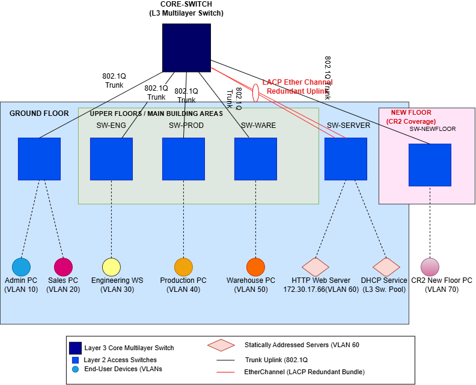
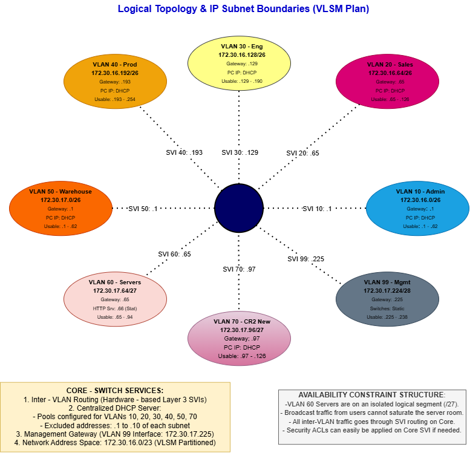

# Tau Metalworks & Engineering Supplies - Enterprise Network Design & Implementation
**Module:** CMPG 325 (Computer Networks) Individual Semester Project  
**Institution:** North-West University  
**Academic Year:** 2026  

---

## Executive Summary

This repository contains the end-to-end design, Packet Tracer implementation, device configurations, testing logs, and change management documentation for the enterprise network of **Tau Metalworks & Engineering Supplies**, a manufacturing organisation based in Potchefstroom, South Africa.

The network architecture addresses key business requirements, including departmental segmentation, centralized dynamic addressing, high-availability server access, secure administrative access, internal web hosting, and dynamic scaling to accommodate physical site expansions (Change Request CR2).

---

## Project Specifications

| Specification Field | Project Detail |
|---|---|
| **Student Name & ID** | T. Magwatane (42710677) |
| **Module Code** | CMPG 325 - Computer Networks |
| **Project Identifier** | CMPG325-2026-034 |
| **Client ID** | CLI-034 |
| **Assigned Organisation** | Tau Metalworks & Engineering Supplies |
| **Location** | Potchefstroom, South Africa |
| **Industry Sector** | Manufacturing |
| **Assigned IP Block** | `172.30.16.0/23` (`172.30.16.0` – `172.30.17.255`) |
| **Networking Challenge** | HTTP/Web Server - Internal Web Service Hosting |
| **Business Constraint** | High Availability: Critical services must remain accessible during business hours |
| **Change Request** | CR2 - Integration of an additional floor/building expansion |
| **Simulation Platform** | Cisco Packet Tracer (v8.0+) |
| **Project Timeline** | 14 August 2026 – 16 October 2026 |

---

## Project Milestones & Deliverables

| Milestone | Target Date | Description | Status |
|---|---|---|---|
| **Milestone 1** | 28 August 2026 | Client Requirements Analysis & Network Design Proposal | Completed |
| **Milestone 2** | 02 October 2026 | Cisco Packet Tracer Implementation, SVI Routing & Verification | Completed |
| **Final Submission**| 16 October 2026 | Final Technical Report, Evidence Package & Repository Review | Pending |

---

## Network Architecture & Topologies

### 1. Physical Topology

The physical layout follows an **Extended-Star / Hierarchical Network architecture** modeled in Cisco Packet Tracer, centered on a 3560-24PS Layer-3 Multilayer Switch (`CORE-SWITCH`) interconnected to 2960-24TT access layer switches via 802.1Q trunk lines and an LACP EtherChannel bundle[cite: 3].



#### Physical Architecture & Device Mapping
* **Core Distribution Layer:**
  * **`CORE-SWITCH` (Cisco 3560-24PS):** Functions as the central Layer-3 routing engine, default gateway for all SVIs, dynamic DHCP server, and network backbone[cite: 3].
* **Access Layer Switches (Cisco 2960-24TT):**
  * **`SW-GROUND` (Ground Floor):** Connects `PC-ADMIN` (VLAN 10 - Administration) and `PC-SALES` (VLAN 20 - Sales)[cite: 3]. Trunked via 802.1Q passing VLANs 10, 20, 99[cite: 3].
  * **`SW-ENG` (Engineering Floor):** Connects `PC-ENGINEERING` (VLAN 30 - Engineering)[cite: 3]. Trunked via 802.1Q passing VLANs 30, 99[cite: 3].
  * **`SW-PROD` (Production Floor):** Connects `PC-PRODUCTION` (VLAN 40 - Production)[cite: 3]. Trunked via 802.1Q passing VLANs 40, 99[cite: 3].
  * **`SW-WAREHOUSE` (Warehouse Area):** Connects `PC-WAREHOUSE` (VLAN 50 - Warehouse)[cite: 3]. Trunked via 802.1Q passing VLANs 50, 99[cite: 3].
  * **`SW-SERVERS` (Server Room - VLAN 60):** Houses the internal HTTP Web Server (`SRV-HTTP` / `172.30.17.66`)[cite: 3]. Connected to `CORE-SWITCH` via a redundant **LACP EtherChannel (Po1)** carrying VLANs 60, 99[cite: 3].
  * **`SW-NEWFLOOR` (New Floor - CR2):** Accommodates expansion workstation `PC-CR2` (VLAN 70 - Dynamic DHCP)[cite: 3]. Trunked via 802.1Q passing VLANs 70, 99[cite: 3].
* **Management & Control:** VLAN 99 (`172.30.17.224/28`) is configured across all switch trunks for centralized in-band administrative access[cite: 3].

---

### 2. Logical Topology & SVI Routing Model

Logical segmentation is enforced through IEEE 802.1Q VLANs[cite: 1, 3]. All inter-VLAN routing and dynamic addressing services are centralized on `CORE-SWITCH` using Switch Virtual Interfaces (SVIs)[cite: 1, 3].



#### Core Switch Services & Controls
* **Inter-VLAN Routing:** Performed in hardware on `CORE-SWITCH` via SVIs (`SVI 10`, `20`, `30`, `40`, `50`, `60`, `70`, `99`)[cite: 1].
* **Centralized DHCP Server:** Dynamic pools configured for VLANs 10, 20, 30, 40, 50, and 70 with static address exclusions (`.1` to `.10`) reserved per subnet[cite: 1].
* **Management Subnet:** VLAN 99 gateway configured at `172.30.17.225/28` for administrative switch access[cite: 1, 3].
* **Availability Constraint Response:** Server traffic (VLAN 60) is isolated on a `/27` subnet to eliminate broadcast degradation from user subnets[cite: 1, 3].

---

## IP Addressing Plan (`172.30.16.0/23`)

Variable Length Subnet Masking (VLSM) was applied to partition the assigned `/23` block (`172.30.16.0` – `172.30.17.255`) efficiently across all departmental segments[cite: 1].

| VLAN | Department / Purpose | Subnet Address | Mask | Usable Range | Default Gateway | Allocation Type |
|---|---|---|---|---|---|---|
| **10** | Administration | `172.30.16.0` | `/26` (`.192`) | `172.30.16.1` – `172.30.16.62` | `172.30.16.1` | Dynamic (DHCP) |
| **20** | Sales | `172.30.16.64` | `/26` (`.192`) | `172.30.16.65` – `172.30.16.126` | `172.30.16.65` | Dynamic (DHCP) |
| **30** | Engineering | `172.30.16.128` | `/26` (`.192`) | `172.30.16.129` – `172.30.16.190` | `172.30.16.129` | Dynamic (DHCP) |
| **40** | Production Floor | `172.30.16.192` | `/26` (`.192`) | `172.30.16.193` – `172.30.16.254` | `172.30.16.193` | Dynamic (DHCP) |
| **50** | Warehouse | `172.30.17.0` | `/26` (`.192`) | `172.30.17.1` – `172.30.17.62` | `172.30.17.1` | Dynamic (DHCP) |
| **60** | Servers (HTTP / Core) | `172.30.17.64` | `/27` (`.224`) | `172.30.17.65` – `172.30.17.94` | `172.30.17.65` | Static (`.66`) |
| **70** | Expansion Floor (CR2) | `172.30.17.96` | `/27` (`.224`) | `172.30.17.97` – `172.30.17.126` | `172.30.17.97` | Dynamic (DHCP) |
| **99** | Switch Management | `172.30.17.224` | `/28` (`.240`) | `172.30.17.225` – `172.30.17.238` | `172.30.17.225` | Static |

> **DHCP Exclusions:** Addresses `.1` through `.10` in each dynamic subnet are excluded on `CORE-SWITCH` for gateway SVIs, static devices, and expansion reserve[cite: 1].

---

## Technical Solutions & Constraint Implementation

### 1. Assigned Challenge - Internal HTTP Web Server
* **Server Details:** Static IP `172.30.17.66/27` on VLAN 60 with gateway `172.30.17.65` (`SRV-HTTP`)[cite: 3].
* **Reachability:** Verified across all departmental VLANs via SVI inter-VLAN routing on `CORE-SWITCH`[cite: 1, 3].

### 2. High Availability Response (Business Hours Availability)
* **Physical Redundancy:** A bundled **LACP EtherChannel (Po1)** carrying VLANs 60 and 99 connects `CORE-SWITCH` to `SW-SERVERS`, safeguarding against single cable or port failures[cite: 3].
* **Logical Isolation:** VLAN 60 is placed on an isolated `/27` subnet, preventing end-user broadcast traffic from impacting core services[cite: 1, 3].

### 3. Change Request Integration (CR2)
* **Scope:** Incorporation of a new building floor (`SW-NEWFLOOR`)[cite: 3].
* **Implementation:** Integrated via **VLAN 70 (`172.30.17.96/27`)** over an 802.1Q trunk carrying VLANs 70 and 99 without requiring IP re-addressing on existing subnets[cite: 3].

---

## Repository Structure

```text
tau-metalworks-network-cmpg325-2026034/
│
├── README.md                           # Project Overview & Architecture Documentation
├── technical-report.pdf                # Formal Engineering Report
│
├── 01-requirements/
│   └── client-requirements.md          # Client Scope & Design Requirements
│
├── 02-design/
│   ├── physical-topology.png           # Physical Architecture Diagram
│   ├── logical-topology.png            # Logical SVI & Subnet Boundary Diagram
│   └── design-decisions.md             # Rationale & Structural Trade-offs
│
├── 03-ip-addressing/
│   └── ip-addressing-plan.md           # Detailed VLSM Calculations & Scopes
│
├── 04-configuration/
│   └── device-configs/                 # Cisco Running Configurations per Device
│
├── 05-testing/
│   ├── testing-log.md                  # Inter-VLAN Ping & HTTP Verification Logs
│   └── screenshots/                    # Packet Tracer CLI/GUI Testing Screenshots
│
├── 06-troubleshooting/
│   └── issues-and-fixes.md             # Identified Network Issues & Resolutions
│
├── 07-change-request-CR2/
│   └── cr2-implementation.md           # CR2 Expansion Configuration Details
│
├── packet-tracer/
│   └── tau-metalworks-network.pkt      # Primary Cisco Packet Tracer Simulation File
│
└── Milestone 2/                        # Milestone 2 Review Package
    ├── README.md
    ├── Packet Tracer/
    ├── Report/
    ├── Documentation/
    └── Evidence/
